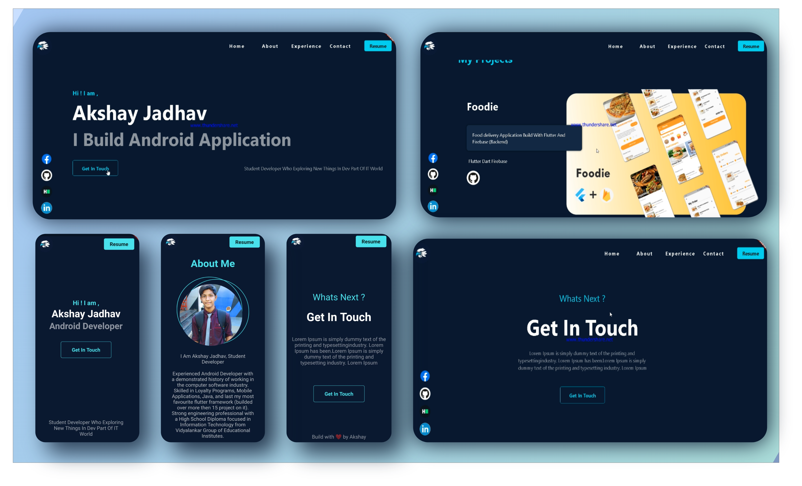

# portfolio

[](https://forthebadge.com)
[](https://forthebadge.com)


## Information 
This is basic portfolio application build with flutter for web and android, 
Anyone can use this code for their own purpose, If you are interested in contributing to make this project then please follow [code-Style](#code-style) and [Contribution steps](#step-to-contribute).

## Installation

<details><summary>Steps</summary>
<p>


**Step 1:**

Download or clone this repo by using the link below:

```
https://github.com/Google-Developer-Student-Club-RAIT/Portfolio_UI_Web-Mobile.git
```

**Step 2:**

Go to project root and execute the following command in console to get the required dependencies: 

```
flutter pub get 
```

**Step 3:**

execute the following command to run the application:

```
flutter packages pub run
```

or watch command in order to keep the source code synced automatically:

```
flutter packages pub run build_runner watch
```

</p>
</details>

<a id="contribute"></a>
## Step to Contribute

<details><summary>Click here</summary>
<p>


**1.**  Fork [this](https://github.com/Google-Developer-Student-Club-RAIT/Portfolio_UI_Web-Mobile) repository.

**2.**  Clone your forked copy of the project.

```
git clone https://github.com/<your_name>/Portfolio_UI_Web-Mobile
```

**3.** Navigate to the project directory :file_folder: .

```
cd Portfolio_UI_Web-Mobile
```

**4.** Add a reference(remote) to the original repository.

```
git remote add upstream https://github.com/Google-Developer-Student-Club-RAIT/Portfolio_UI_Web-Mobile
```

**5.** Check the remotes for this repository.
```
git remote -v
```

**6.** Always take a pull from the upstream repository to your master branch to keep it at par with the main project(updated repository).

```
git pull upstream main
```

**7.** Create a new branch.

```
git checkout -b <your_branch_name>
```

**8.** Perform your desired changes to the code base.


**9.** Track your changes:heavy_check_mark: .

```
git add . 
```

**10.** Commit your changes .

```
git commit -m "Relevant message"
```

**11.** Push the committed changes in your feature branch to your remote repo.
```
git push -u origin <your_branch_name>
```

**12.** To create a pull request, click on `compare and pull requests`. Please ensure you compare your feature branch to the desired branch of the repository you are supposed to make a PR to.


**13.** Add appropriate title and description to your pull request explaining your changes and efforts done.


**14.** Click on `Create Pull Request`.


**15** Congratulations! You have made a PR. Sit back patiently and relax while your PR is reviewed.


</p>
</details>

<a id="codeStyle"></a>
## Code-Style

// make wiki guide page for dart code-style  

### Contributors

### Contact

Maintainer : harsh.kulkarni.42774@gmail.com

## LICENSE
Copyright (c) **GDSC Rait**. All rights reserved. Licensed under the MIT License

[](LICENSE)

